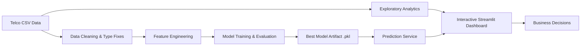
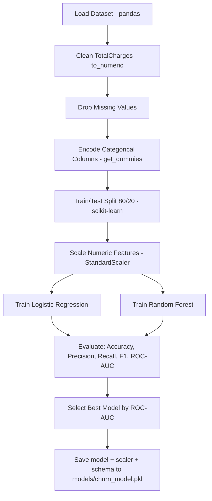
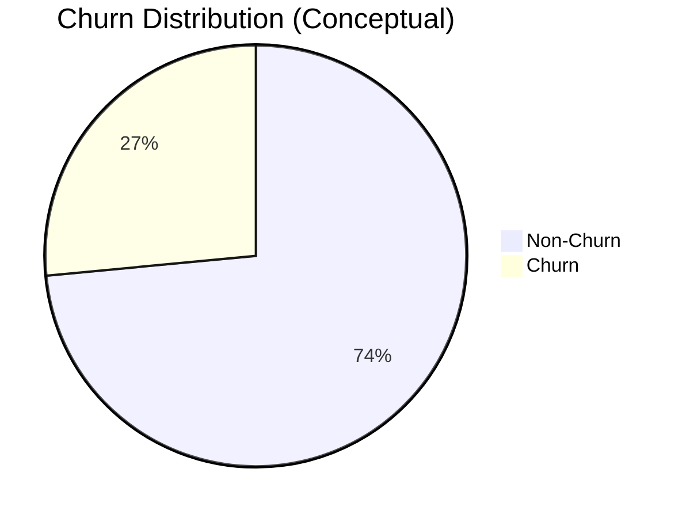

# Customer Churn Intelligence Platform

Production-ready machine learning + analytics dashboard for predicting telecom customer churn using the Telco Customer Churn dataset.


---

## Table of Contents
- [Project Overview](#project-overview)
- [Interactive Architecture Graph](#interactive-architecture-graph)
- [Machine Learning Pipeline Graph](#machine-learning-pipeline-graph)
- [Model Performance Snapshot](#model-performance-snapshot)
- [Dashboard Capabilities](#dashboard-capabilities)
- [Project Structure](#project-structure)
- [Quick Start](#quick-start)
- [Deployment on Streamlit Cloud](#deployment-on-streamlit-cloud)
- [How to Interpret Predictions](#how-to-interpret-predictions)
- [Business Recommendations](#business-recommendations)
- [Troubleshooting](#troubleshooting)

---

## Project Overview

This project transforms raw customer subscription and billing data into:

1. **Actionable churn analytics** (KPI cards, heatmaps, correlation views, risk segmentation)
2. **Predictive intelligence** (best model selected via metric-based comparison)
3. **Business insights** (retention-focused conclusions and recommendations)

Core objective: **identify who is likely to churn, why, and what to do next**.

---

## Interactive Architecture Graph



---

## Machine Learning Pipeline Graph



---

## Model Performance Snapshot

From current training output:

| Model | Accuracy | Precision | Recall | F1 | ROC-AUC |
|------|---------:|----------:|-------:|---:|--------:|
| Logistic Regression | 0.8038 | 0.6485 | 0.5722 | 0.6080 | **0.8359** |
| Random Forest | 0.7875 | 0.6271 | 0.4947 | 0.5531 | 0.8137 |

**Selected production model:** Logistic Regression (highest ROC-AUC).



---

## Dashboard Capabilities

### Sections included
- **Overview**: customer KPIs + distribution snapshots
- **Data Explorer**: filters + advanced multi-chart analysis
- **Correlation & Heatmaps**: numeric correlation map + churn hot-zones
- **Model Lab**: model comparison, feature influence, interpretation
- **Customer Prediction**: form-based scoring + risk gauge
- **Business Insights**: risk cohorts + retention recommendations
- **Methodology**: library-by-library, step-by-step explanation
- **Data Catalog**: full table view + downloadable filtered CSV

### Library usage map

| Purpose | Library/Tool |
|---|---|
| Data loading & transformation | `pandas`, `numpy` |
| Modeling & evaluation | `scikit-learn` |
| Model persistence | `joblib` |
| Dashboard app | `streamlit` |
| Interactive visuals | `plotly` |

---

## Project Structure

```text
customer-churn-prediction
│
├── data/
│   └── Telco-Customer-Churn.csv
├── notebooks/
│   └── churn_analysis.ipynb
├── src/
│   ├── data_preprocessing.py
│   ├── train_model.py
│   ├── predict.py
│   └── __init__.py
├── models/
│   └── churn_model.pkl
├── app/
│   └── streamlit_app.py
├── .streamlit/
│   └── config.toml
├── requirements.txt
└── README.md
```

---

## Quick Start

### 1) Install dependencies
```bash
pip install -r requirements.txt
```

### 2) Train model artifact
```bash
python src/train_model.py --data-path data/Telco-Customer-Churn.csv --model-output models/churn_model.pkl
```

### 3) Run dashboard
```bash
streamlit run app/streamlit_app.py
```

Open the URL printed in terminal (typically `http://localhost:8501`).

---

## Deployment on Streamlit Cloud

1. Push repository to GitHub.
2. Open Streamlit Cloud and create a new app.
3. Set entrypoint file to: `app/streamlit_app.py`
4. Ensure `requirements.txt` exists at repository root.
5. Deploy.

---

## How to Interpret Predictions

Prediction output is probability-based:

- **Low Risk**: probability < 0.35
- **Medium Risk**: 0.35 to 0.65
- **High Risk**: > 0.65

The model estimates churn likelihood from billing behavior, contract pattern, tenure, internet service profile, payment method, and related customer attributes.

---

## Business Recommendations

- Prioritize **month-to-month + high charges** segments for retention campaigns.
- Trigger proactive outreach in early lifecycle (low tenure cohorts).
- Incentivize annual contract migration for high-risk customers.
- Optimize payment-method experience where churn concentration is high.

---

## Troubleshooting

<details>
<summary><strong>Model file missing</strong></summary>

Run:

```bash
python src/train_model.py --data-path data/Telco-Customer-Churn.csv --model-output models/churn_model.pkl
```

</details>

<details>
<summary><strong>Streamlit port already in use</strong></summary>

Run on another port:

```bash
streamlit run app/streamlit_app.py --server.port 8503
```

</details>

<details>
<summary><strong>Environment/package issues</strong></summary>

Reinstall dependencies:

```bash
pip install -r requirements.txt --upgrade
```

</details>

---

## Notes

- Model artifact includes preprocessing metadata (`feature_columns`, `numeric_columns`, scaler) for consistent inference.
- Dashboard is optimized for analytics storytelling, experimentation, and business decision support.
